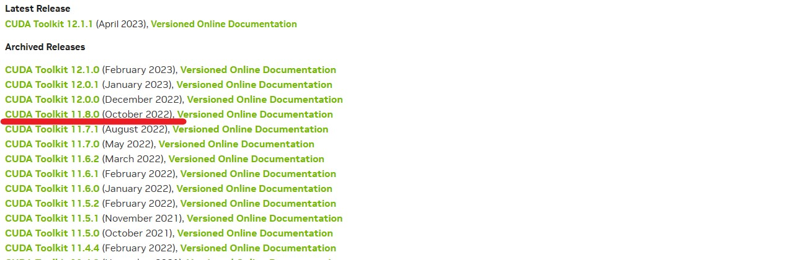
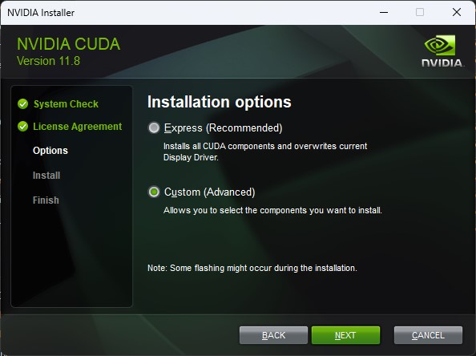
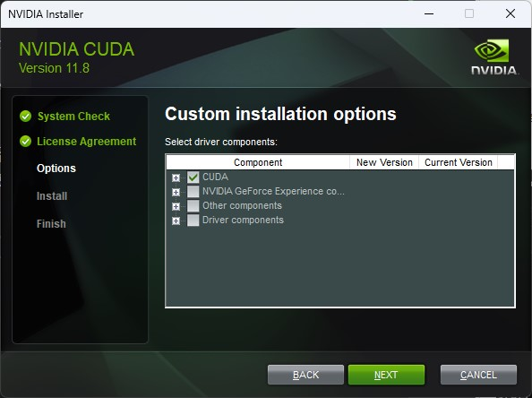
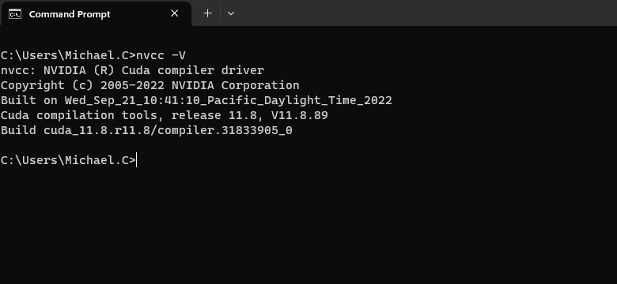
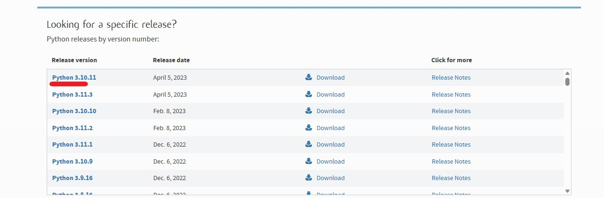
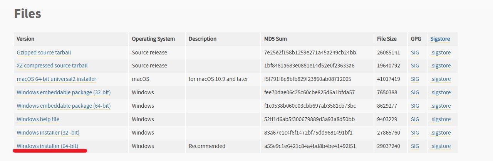
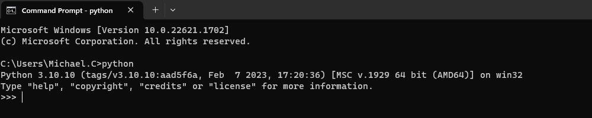
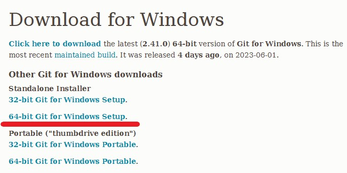
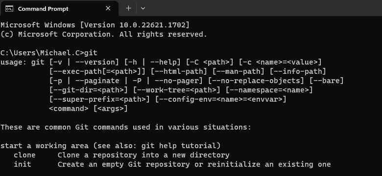
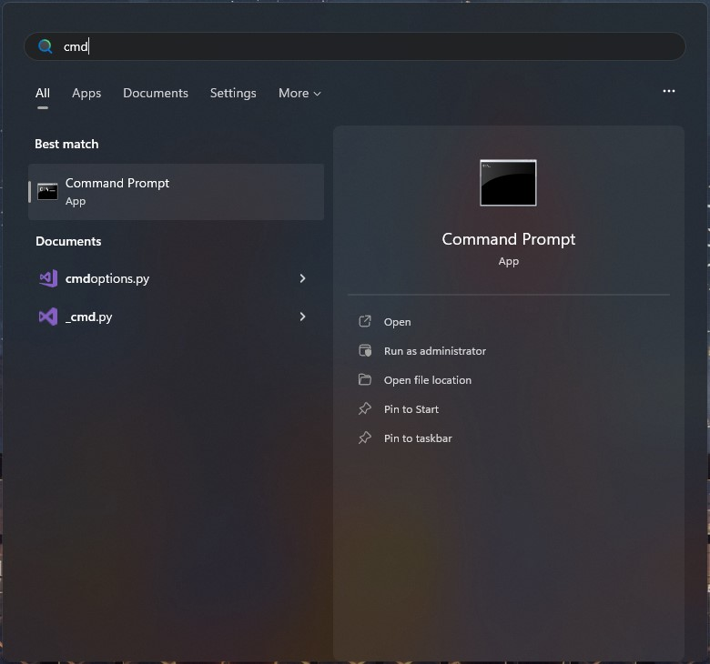

<h1 align="center">Stable Diffusion 安裝環境</h1>
<h3 align="center">for Automatic1111 Webui</h3>

<b>by. Haoming</b> <i>Last Update: 2023/06/15</i>

## CUDA Toolkit
1. 前往 [https://developer.nvidia.com/cuda-toolkit-archive](https://developer.nvidia.com/cuda-toolkit-archive)

2. 下載並安裝 `CUDA Toolkit 11.8` (`12.x` **不支援**)

3. 安裝過程，強烈建議選擇 `Custom` ，並取消 `GeForce` 、 `Other` 、 `Driver` 的選項

 

4. 完成後，可以透過在 `cmd` [*](#cmd) 中輸入 `nvcc -V` 以確認是否正確安裝
    - 若安裝正確，會出現如下之版本等資訊。再次注意版本須為 **`11.8`** !

## Python
1. 前往 [https://www.python.org/downloads/](https://www.python.org/downloads/)

2. 點選 `Python 3.10.x` (`3.11.x` **不支援**)

3. 下載並安裝     

4. 安裝時記得勾選 `Add python.exe to PATH`

5. 完成後，可以透過在 `cmd` 中輸入 `python` 以確認是否正確安裝
    - 若安裝正確，會出現如下之版本等資訊。再次注意版本須為 **`3.10.x`** !

## Git
1. 前往 [https://git-scm.com/downloads](https://git-scm.com/downloads)

2. 下載並安裝 `git` *(全部選項預設即可)*

3. 完成後，可以透過在 `cmd` 中輸入 `git` 以確認是否正確安裝
    - 若安裝正確，會出現如下之使用方法等資訊

## Checkpoint
1. 前往 [CivitAI](https://civitai.com/?tag=base+model)

2. 下載任意 Checkpoint
    - **個人推薦**
    - 擬真: [Realistic Vision](https://civitai.com/models/4201/realistic-vision-v20)
    - 二次元: [UHD-23](https://civitai.com/models/22371/uhd-23)

3. 按下藍色 `Download` 鍵即可

##### CMD
按下 `Windows` 鍵並搜尋 `cmd` 以開啟 **Command Line Interface** *(CLI)*

